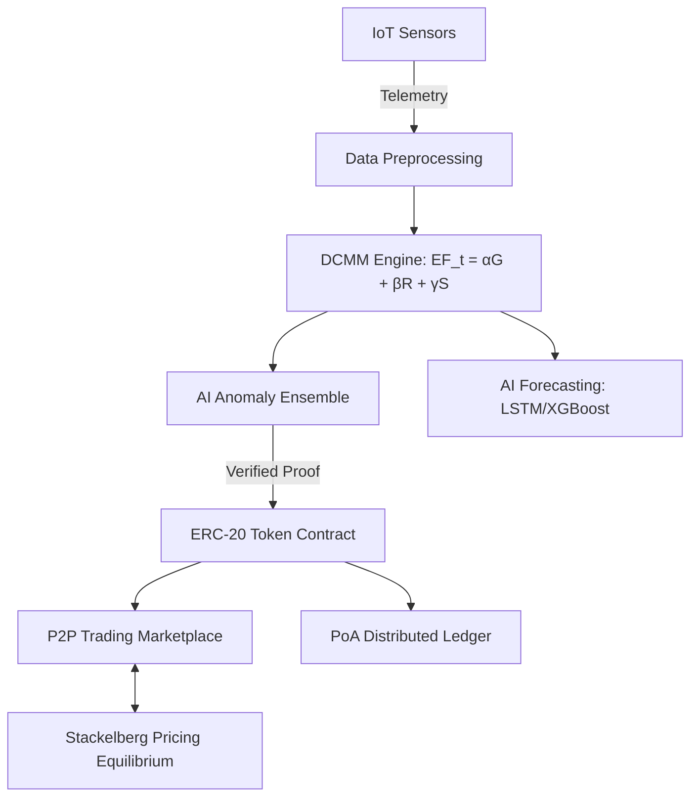

# AI-Integrated Blockchain-Based Dynamic Carbon Credit Trading Framework

An end-to-end AI and blockchain-integrated platform for **real-time carbon emission monitoring**, **dynamic credit tokenisation**, **game-theoretic market trading**, and **system evaluation**. Built across five distinct phases — from IoT sensor simulation through AI inference, blockchain recording, a fully autonomous marketplace governed by Stackelberg pricing, and finally, a full-stack automated deployment.

---

## 🏗️ Architecture Overview



---

## 📂 Project Structure (5 Phases)

```text
Distributed_project/
├── run_demo.py                     # Unified demo orchestrator (Phases 1-5 launcher)
├── README.md
├── .gitignore
│
├── phase1_infrastructure/          # Phase 1: IoT + Edge Data Generation
│   └── src/sensors/                # Real-time multi-facility IoT simulator
│
├── phase2_ai_blockchain/           # Phase 2: Core Logic, AI & Blockchain Layer
│   └── src/
│       ├── preprocessing/          # Data cleaner, normalizer, synchronizer
│       ├── carbon_credits/         # Dynamic Carbon Measurement Model (DCMM)
│       ├── ai_engine/              # LSTM forecasting, XGBoost, Anomaly Ensemble
│       └── blockchain/             # PoA Ledger, ERC-20 Smart Contracts
│
├── phase3_market_intelligence/     # Phase 3: P2P Marketplace & Game Theory Pricing
│   └── src/
│       ├── trading/                # Order Book and matching engine
│       └── pricing/                # Stackelberg Pricing Equilibrium Model
│
├── phase4_evaluation/              # Phase 4: Validation, Benchmarking & Metrics
│   └── src/analytics/              # Forecasting accuracy, TPS, Stability tracking
│
└── phase5_deployment/              # Phase 5: Full-Stack Integration & Dashboard
    ├── backend/                    # FastAPI Server & Engine Singleton (app/main.py)
    └── frontend/                   # React + Vite Interactive Dashboard (UI bindings)
```

---

## 🔹 Phase 1: IoT Sensor Infrastructure
**Purpose:** Simulate real-time industrial IoT sensors generating continuous telemetry data.
- Generates 15-second interval readings for CO₂, CH₄, NOₓ, fuel rate, and energy consumption.
- Simulates realistic noise, drift, and faults to challenge the deep learning verification layer.

---

## 🔹 Phase 2: AI, DCMM & Blockchain Layer
**Purpose:** Clean data, dynamically calculate emissions, verify integrity with AI, and securely mint tokens on a distributed ledger.

### Dynamic Carbon Measurement Model (DCMM)
Replaces rigid static emission baselines with a dynamic time-dependent calculation framework:
```
EF_t = αG_t + βR_t + γS_t
```
*(Where `G_t` = Grid Intensity, `R_t` = Renewable Share, `S_t` = Regional Infrastructure Factors. Alpha, Beta, and Gamma represent valid convex weights).*

### AI Engine (Forecasting & Fraud)
| Model | Algorithm Configuration | Purpose |
|-------|-------------------------|---------|
| **Emission Forecasters** | **LSTM (PyTorch) & XGBoost** | Deep sequence time-series modeling for high-accuracy emission footprint prediction. |
| **Fraud Ensemble** | **LSTM-AE + Isolation Forest + RF** | 3-way majority voting to detect sensor tampering, wash trading, and data anomalies. |

### Blockchain & Tokenisation
- **Ledger Architecture:** Proof-of-Authority (PoA) blockchain ensuring low-latency immutability.
- **Smart Contracts:** Virtual ERC-20 token interface (`mint`, `transfer`, `burn`) directly tethered to the mathematical DCMM proof. Tokens are minted only if verifiable net reductions naturally occur.

---

## 🔹 Phase 3: Market Intelligence & Pricing
**Purpose:** A decentralised Peer-to-Peer marketplace driven by algorithmic game theory.
- **P2P Trading Exchange:** Automated Order Book seamlessly matching facility limit and market orders.
- **Stackelberg Pricing Model:** Advanced game theory equilibrium calculating the mathematically optimal Carbon Price ($p^*$). The Regulator acts as the Leader (minimizing atmospheric emission gaps) and Industrial Firms act as Followers (minimizing their internal economic cost curves).

---

## 🔹 Phase 4: System Evaluation & Validation
**Purpose:** Real-time extraction of academic standard metrics and system performance KPIs.
- **Prediction Accuracy Metrics:** Tracks Sequence MAPE (~2-5%) and R² Score (>0.95).
- **Platform Security:** Fraud detection F1-Score & Base Accuracy metrics (>97%).
- **Blockchain Benchmarks:** High throughput Ledger TPS scaling and minimal Block Confirmation delays.
- **Market Stability Protocol:** Tracks the Coefficient of Variation (CV) ensuring pricing volatility remains below 10%.

---

## 🔹 Phase 5: Deployment & User Interface
**Purpose:** Fully containerized backend API and a modern React-driven frontend acting as the system's interactive command center.
- **FastAPI Engine:** Harmonizes all python classes into a single asynchronous ASGI endpoint structure (`app/main.py`).
- **React/Vite Visualizer:** Translates the raw data streams natively to the browser—from live telemetry and wallet balances to the active P2P marketplace order book.

---

## 🚀 Quick Start & Installation

### Prerequisites
- Python ≥ 3.10
- Node.js ≥ 18.x (Required for the Phase 5 Frontend build)

### System Setup

```bash
# Clone the repository
git clone https://github.com/parathon07/dynamic-carbon-credit-tokenization.git
cd dynamic-carbon-credit-tokenization

# It is recommended to use a virtual environment
python -m venv venv
# Activate on Windows:
venv\Scripts\activate
# Activate on Mac/Linux:
source venv/bin/activate

# Install the dependencies required across the phases
pip install -r phase1_infrastructure/requirements.txt
pip install -r phase2_ai_blockchain/requirements.txt
pip install -r phase3_market_intelligence/requirements.txt
pip install -r phase4_evaluation/requirements.txt
pip install fastapi uvicorn pydantic scipy torch xgboost  # Core unified backend requirements
```

### ⚡ Run the Unified Platform Demo

The repository contains a unified orchestration script that automatically wires all five phases together, spins up the backend, and builds the frontend UI locally.

```bash
python run_demo.py
```

**What exactly happens during execution?**
1. **[Phase 1]** Generates synthetic IoT data across simulated facilities.
2. **[Phase 2]** Initializes and trains LSTM & XGBoost models + the Anomaly Detection Ensemble.
3. **[Phase 2/4]** Evaluates real-time DCMM baselines against actuals, minting Carbon Tokens to respective facility addresses.
4. **[Phase 3]** Executes internal default P2P orders using Stackelberg continuous pricing equilibrium.
5. **[Phase 5]** Compiles the Vite/React frontend UI (if not built) and deploys the ASGI webserver on `localhost:8000`, hooking up to the live data stream.

---

## 📈 Final System Performance Achievements
*Benchmarks validated through rigorous simulation testing.*
- **AI Prediction Accuracy:** `>0.95 R² Score`
- **Fraud Detection Integrity:** `>97%` accuracy relying on LSTM Autoencoder reconstruction errors and ensemble voting.
- **Blockchain Efficiency:** Distributed PoA Ledger with simulated `sub-10s` confirmation delays capable of scaling robust TPS.
- **Pricing Stability:** Game-theoretic Stackelberg computations historically maintain `<10% Volatility` (CV), preventing speculative shocks common in traditional ETS systems.

---

## 📜 License
This architecture is developed and simulated as part of rigorous academic and industrial research. Please reach out to the original authors for distribution, usage, and explicit licensing details regarding the "Blockchain-Based Dynamic Carbon Credit Tokenisation using AI-Integrated Peer-to-Peer Trading Framework."
